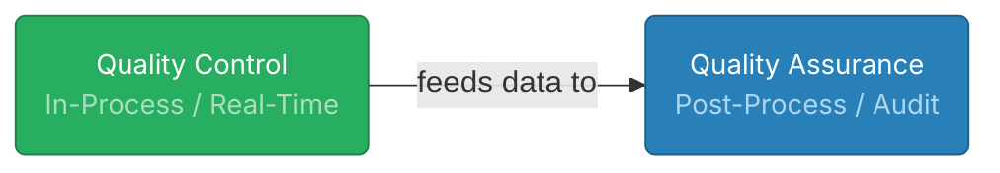

**Chapter 6 – Quality Control**

> [!summary] Core Purpose  
> Quality control ensures **stability** in performance by detecting variation and correcting it through a **feedback loop**.  
> It maintains current performance levels after improvement projects have elevated them.

---

## 1 Quality Control in Context

Quality control is the **third pillar** of the _Juran Trilogy_:

1. Plan for Quality → 2. Improve Quality → 3. <b>Control Quality</b>
    

The goal is to **maintain gains** achieved through improvement and prevent regression.  
When a process runs _consistently but below acceptable standards_, you don’t need _more control_—you need _improvement_.  
Once improved, you create _new controls_ to preserve the higher level of performance.

> [!learn]  
> **Control ≠ Inspection**  
> Inspection finds defects after the fact. Control **prevents** them by managing variation.

---

## 2 Key Terms: KPC and KCC

- <b>Key Product Characteristics (KPCs)</b> → measurable features _on, within, or about_ the product that affect safety, performance, or fit.
    
    - _Examples_: surface finish (on), hardness (within), weight (about).
        
- **Key Control Characteristics (KCCs)** → process parameters influencing KPCs.
    
    - _Examples_: temperature, torque, feed rate.
        
    - Must be stable and held near target values.
        

> [!important]  
> Control focuses on managing <b>KCCs</b> so that <b>KPCs</b> remain within limits.  
> Output quality depends on input control.

---

## 3 Relation to Quality Assurance

| Aspect            | Quality Control                    | Quality Assurance                 |
| :---------------- | :--------------------------------- | :-------------------------------- |
| **Purpose**       | Maintain control during operations | Verify control _after_ operations |
| **Timing**        | Real-time or in-process            | After the fact / audits           |
| **Users of Data** | Operators, supervisors             | Management, regulators, customers |
| **Metric Focus**  | Process metrics                    | Result metrics                    |

Both compare performance to goals, but **QC is active control** while **QA is verification**.

---

## 4 The Feedback Loop

All control relies on a feedback system consisting of:

1. **Sensor** – measures actual performance.
    
2. **Umpire** – compares actual vs standard.
    
3. **Actuator** – triggers correction.
    
4. **Process** – responds to restore conformance.
    

Examples:

- Thermostat (automatic control)
    
- Employee self-control (manual feedback)
    

> [!learn]  
> A capable process + trained, empowered workers = self-control.  
> The worker must know what is expected, how they are doing, and have the means to adjust.

---

## 5 Elements of Control

### 5.1 Choose Control Subjects

Select _what_ to control using:

- Customer requirements (VOC)
    
- Safety / environment needs
    
- Standards (ISO 9000, OSHA)
    
- Past failures and risk analyses (FMEA)
    

> [!tip]  
> At higher levels, control subjects broaden from technical specs to business and customer outcomes.

---

### 5.2 Establish Measurement

Define:

- **Sensor** type (tool or person)
    
- Accuracy & frequency
    
- Data recording and reporting methods
    

Good measures are **understandable, consistent, and decision-driving**.

---

### 5.3 Set Standards of Performance

Each control subject gets a target goal (numeric or qualitative).  
Goals must be <b>legitimate, measurable, attainable, equitable</b>.

**Product goals:** meet customer needs, reliability, durability.  
**Process goals:**

- Produce conforming output.
    
- Stay statistically stable (“in control”).
    

---

### 5.4 Measure Actual Performance

Collect real data from sensors.  
At lower levels, this is real-time.  
At higher levels, aggregated to dashboards or scorecards.

---

### 5.5 Compare to Standards

The “umpire” judges whether variation is acceptable and triggers action.  
This is where control charts are typically applied.

> [!question] Prompted response
> The umpire = the decision-maker in the feedback loop.
> It bridges sensing (data collection) and action (correction), ensuring the process returns to its desired state.

---

## 6 Taking Action on the Difference

When a gap exists between actual and target:

1. **Detect** deviation.
    
2. **Diagnose** the cause (special vs common).
    
3. **Correct** through an actuator (machine setting, procedure update, policy change).
    
4. **Verify** stability restored.
    

---

### 6.1 Corrective Action Methods

> [!example] The PDCA / PDSA Cycle 
> 
> Revision from [[Lecture 11#🔄 3 PDCA / PDSA Cycle (core improvement loop)]]  
> 
> A continuous improvement loop for process control and learning.
> 
> - **Plan** — Choose control subjects and set clear goals.
>     
> - **Do** — Operate and monitor the process.
>     
> - **Check / Study** — Compare actual results to standards.
>     
> - **Act** — Apply corrective actions and standardize improvements.
> 
> PDCA deals with **sporadic problems**—temporary spikes in variation.  
> For **chronic problems**, structured improvement tools like **Six Sigma DMAIC** are used.

> [!note]  
> RCCA (Root Cause & Corrective Action) uses simpler, graphical tools for day-to-day issues.  
> DMAIC tackles complex, recurring issues requiring statistical depth.

---

## 7 Process Capability and Control Charts (Link to Next Section)

While this section ends before _“Pyramid of Control”_, later content connects:

- **Process capability** → quantifies how much variation exists vs spec limits.
    
- **Control charts** → detect whether variation is random (common) or due to specific causes (special).  
    These tools operationalize the feedback loop statistically.
    

> [!important]  
> A process can be _in statistical control_ yet still _incapable_ of meeting specs.  
> Improvement shifts the mean; control holds it steady.

---

## 8 Conceptual Takeaways

- Quality control = stabilize, not improve.
    
- Feedback loops apply to all levels and functions.
    
- Control depends on measurement, comparison, and response.
    
- PDCA provides a universal troubleshooting model.
    
- Empowered self-control reduces inspection cost and raises ownership.
    
> [!question] What does _self-control_ mean in quality control?  
> It’s when the **person closest to the process** — often a machine operator or line worker — can **measure, judge, and correct** their own work in real time.  
> This keeps quality stable **at the source**, builds ownership, and **reduces inspection costs** because issues are fixed _during_ production, not after.

---

> [!exam] High-Yield Focus
> 
> - Feedback loop structure (sensor–umpire–actuator–process)
>     
> - Difference between QC and QA
>     
> - KPC vs KCC
>     
> - PDCA cycle steps and use cases
>     
> - Purpose of control charts and process capability
>     

---

**Next Reading Boundary:** _Stop before “Pyramid of Control”_

Reference: Juran (2017) _Quality Handbook 7th Edition_ §6.0 – §6.5

---

https://chatgpt.com/share/69033a40-c2d8-8013-bb5c-92e067777467