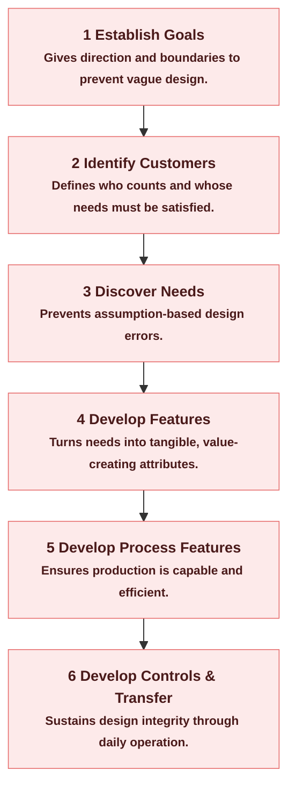

# Chapter 4 – Quality Planning & Design

> [!summary] Purpose
> This chapter introduces the **first process of the Juran Trilogy** — *Quality Planning*, which is about **designing for quality and innovation.**
> It establishes how organisations convert customer needs into product and process designs that satisfy both the customer and operational requirements.

---

## 1. Where This Fits in the Juran Trilogy

> [!example] Juran's Trilogy — Revision
>
> Revision from [[Quality Fundamentals & Juran Trilogy (Ch1)#🔺 Juran's Trilogy (The Core Framework)]]
>
> Juran's Trilogy defines three universal management processes:
> 1. **Quality <span style="color:rgb(25, 103, 116)">Planning</span>** – Create new products, services, or processes that meet customer needs.
> 2. **Quality<span style="color:rgb(240, 148, 31)"> Control</span>** – Keep performance within targets during operation.
> 3. **Quality <span style="color:rgb(196, 51, 2)">Improvement**</span> – Elevate performance to new levels.
>
> This chapter focuses on the *first one* — **planning**, because every great product starts with great design.
> If the design is wrong, control and improvement are fighting uphill battles.
>
> Design is the *root of quality*.
> A poor design guarantees a poor outcome no matter how well you control or improve later.

---

## 2. The Purpose of Quality by Design (QbD)

Quality by Design ensures that products and services are **fit for purpose** from the start — meaning:
- They meet **customer needs** (features that satisfy), and  
- They avoid **failures** (freedom from defects or dissatisfaction).

Modern design therefore has a **dual responsibility**:
1. To design the *right <span style="color:rgb(239, 96, 36)">features</span>* for the customer.  
2. To design *<span style="color:rgb(239, 96, 36)">processes</span> capable of producing those features consistently.*

> [!tip]  
> Traditional design stopped at “what should the product do?”  
> QbD extends it to “can our process reliably make that product?”

---

## 3. The Quality by Design Problem – The Four Gaps

Historically, organisations failed to delight customers not because they didn’t care,  
but because they misunderstood what causes poor quality.  
Juran identified **four smaller gaps** that combine into the overall *quality gap*.

| **Gap** | **Meaning** | **Effect** |
|----------|--------------|------------|
| **1. Understanding Gap** | Weak understanding of customer needs. | Design doesn’t match what customers value. |
| **2. Design Gap** | Customer understanding doesn’t translate into an effective design. | Product or service doesn’t meet the real needs even if intentions were good. |
| **3. Process Gap** | The process cannot consistently deliver the design requirements. | Good design, but production quality fluctuates. |
| **4. Operations Gap** | Day-to-day operations fail to maintain the process or control variation. | Delivery failures and inconsistent service. |

> [!learn] LEARN THIS  
> The Juran model exists to **close all four gaps** — turning customer needs into reliable, profitable outcomes.

---

## 4. The Logic of the Juran Quality by Design Model

The Juran model provides a **structured sequence of steps** for design projects.  
It can be applied to both new products and redesigned processes, and it ensures  
that design decisions are **linked to customer needs** and **operational capability.**

---

### Step 1 — Establish the Project and Design Goals

Design must start with clarity: *What exactly are we designing and why?*

- Each design is treated as a **specific project**, not a vague initiative.  
- Define the **objectives, scope, timeline, and expected outcomes.**  
- Ensure goals align with strategic priorities.

> [!tip]  
> “Design” is always *of something specific* — a car, a training room, a system — never “in general.”

---

### Step 2 — Identify the Customers

In QbD, *customer* means **anyone affected by the design’s outcome.**

That includes:
- **External customers** (buyers, users, regulators, society)  
- **Internal customers** (employees, operators, support teams)

Each group has different, sometimes conflicting needs.  
Identifying them early prevents designs that please one group but harm another.

> [!learn]  
> The customer base is a *cast of characters*, not a single person.

---

### Step 3 — Discover the Customers’ Needs

Understanding needs requires going beyond what customers say.  
It involves listening to the **Voice of the Customer (VOC)** and **Voice of the Market (VOM)**.

- Needs can be functional (“fast”) or emotional (“reliable,” “safe,” “premium”).  
- Regulatory and logistical needs matter too — e.g., carriers, legal bodies, or distributors.  
- Prioritisation is crucial because not all needs can be equally met.

> [!tip]  
> A lower-priority customer doesn’t always mean a lower-priority need.  
> Each stakeholder can stop the design from succeeding if their requirements are ignored.

---

### Step 4 — Develop the Product or Service Features

A **feature** is what enables the customer to meet their need.  
For example:
- Need: Take notes during training.  
- Feature: Desk, whiteboard, or tablet-friendly setup.

Key ideas:
- List all possible features and **prioritise** them.  
- Use structured analysis to decide which survive design optimisation.  
- Aim for balance — not every feature can or should survive.

> [!learn] LEARN THIS  
> Features create **satisfaction**; removing defects only reduces **dissatisfaction.**
>
>*Talking about the customer*


---

### Step 5 — Develop the Process Features

Once features are chosen, determine **how** to make them reliably.

- Evaluate whether current processes can meet design targets.  
- Align **process capability** with **product requirements.**  
- Explore new or improved processes if the existing ones can’t deliver.  
- Define measurable **process goals** (e.g., setup time, cost, yield, speed).

> [!important] KEY PRINCIPLE  
> **Variation comes from processes; goals come from humans.**  
> The process must be capable of achieving the human-defined goals.

---

### Step 6 — Develop Process Controls & Transfer to Operations

Design isn’t complete until operations can **run and control** it sustainably.

1. **Develop Controls** – Create feedback loops that monitor performance.  
   - Examples: checklists, SOPs, control charts, error-proofing mechanisms.  
   - Controls prevent overreaction (“overcontrol”) and keep processes within agreed limits.  
2. **Transfer to Operations** – Involve operators early and ensure they own the process.  
   - Cross-functional collaboration is essential (designers, engineers, managers, users).  
   - Effective handover ensures the new design actually works in practice.

> [!learn] LEARN THIS  
> Successful transfer = Operators are included in design, not just handed the result later.

---

## 5. The Purpose Behind Each Stage

> [!bug] EXAM CRITICAL — Juran Quality by Design Stages
> Know all 6 stages and their PURPOSE
> Textbook extent: Up to before "Juran Quality by Design Model sub-steps"
^exam-critical-juran
````horizontal

````

> [!success] Understanding Flow
> **Needs → Features → Processes → Control → Operations**
> Every stage translates abstract needs into practical, controlled delivery.

---

## 6. Key Distinction – Features vs Failures

- Removing **failures** prevents dissatisfaction but does *not* create satisfaction.  
- Adding **features** generates satisfaction and competitive advantage.

> [!tip]  
> Absence of complaints ≠ presence of delight.  
> Quality design aims for **fitness for use**, not just freedom from defects.

---

## 7. Summary — The Essence of Quality Planning

> [!learn] FINAL INSIGHT  
> Quality Planning = translating *understanding* into *execution.*  
> The Juran model ensures that what customers value is **designed in** and what operations need is **designed for**.

---

> [!exam] HIGH-PRIORITY FOCUS  
> - The six stages of Juran’s Quality by Design Model.  
> - The purpose behind each stage (what it accomplishes).  
> - The four quality gaps and how QbD closes them.  
> - The dual meaning of quality (features that satisfy + freedom from failure).

---
https://chatgpt.com/share/6903262a-6480-8013-9023-6c1cc3d15135