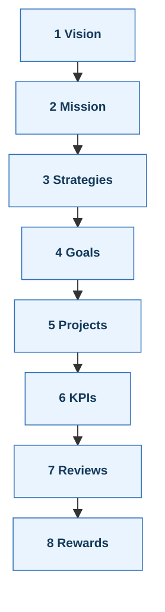

*Lecture 16 — Strategic Planning & Organisational Roles (Ch 7–8)*

> [!danger] **Exam High-Yield Summary**  
> Strategic planning integrates **quality goals** with financial and functional plans, then **deploys** them through every level.  
> Misalignment wastes resources.  
> Quality leadership drives performance excellence.

> [!note] **How to Use This File**  
> Work through each section as a story of cause and effect — not isolated facts.  
> Focus on understanding **alignment**, **deployment**, and **role clarity** before memorising fine details.

---

# *Strategic Planning & Performance Excellence*
[[Chapter 7.pdf]] 
### 1  Why Strategic Planning Matters  
Strategic planning defines where the organisation wants to go and how to get there.  
It converts broad intentions into **specific annual actions** that everyone can own.

A good plan gives clarity, removes wasted effort, and connects all departments under one shared direction.  
When every plan — financial, marketing, quality — flows from the same strategy, the organisation moves as one.

> [!learn] **Business Impact**  
> Organisations that manage quality as a strategic priority consistently outperform competitors.  
> Quality excellence produces not only better products but also stronger financial returns and customer loyalty.

> [!tip] **One Plan, Many Lenses**  
> Finance, HR, operations, and quality all view the same plan through their own performance indicators.

---

### 2  Elements of an Effective Plan

> [!bug] EXAM CRITICAL — Strategic Planning Chain
> Know the sequence: Vision → Mission → Strategies → Goals → Values/Policies
> Textbook extent: Up to "Deployment of Goals" (exclude Hoshin Kanri)
^exam-critical-strategic-planning

Every strong strategy follows a logical chain:
**Vision → Mission → Strategies → Annual Goals → Values / Policies**

- **Vision** shows the desired future — what value the organisation brings to customers, employees, and society.
- **Mission** defines purpose — why the organisation exists.
- **Strategies** translate the vision into a few bold choices that drive direction.
- **Annual goals** turn strategies into measurable targets so progress can be tracked and reviewed.
- **Values and Policies** guide behaviour and decision-making. They must be enforced and audited, not just stated.

> [!learn] **Goal Design**
> Every goal must connect **customer needs** with **process capability**.
> Avoid setting targets that rely only on past performance — improvement demands a forward push.

---

### 3  Governance & Execution  
A **Quality Council or Executive Team** governs the plan.  
They set priorities, review progress, and remove barriers that prevent improvement.  
Lower-level councils mirror this structure so decisions and information flow in both directions.

> [!caution] **Common Failures**  
> - Running isolated “quality programs” with no link to business strategy  
> - Departments chasing separate plans that conflict  
> - Excluding operators from improvement decisions  
> The fix: fully integrate quality goals into the main business plan.

---

### 4  Deployment in Practice

> [!bug] EXAM FOCUS — Deployment Application
> Speaker 2: "How would you suggest they go about it?"
> Expect questions on implementing quality management plans
^exam-focus-deployment

Deployment means turning strategy into **projects** with clear owners, resources, timelines, and indicators.
Goals are broken into sub-goals and assigned to teams and individuals.
This ensures responsibility is visible and progress can be tracked.

> [!question] **Check Your Understanding**
> Can you follow one strategic goal all the way down to its projects and KPIs?
> If not, the deployment is incomplete.

---

# Organisational Roles in Quality Management  
*chapter 8*
### 1  Why Roles Matter  
Everyone contributes to quality, but not in the same way.  
Executives set direction, councils coordinate, quality professionals build systems, line managers own processes, teams solve problems, and employees control quality at the source.

Clear roles prevent overlap, confusion, and wasted effort.

---

### 2  Upper Management  
Senior leaders form the **Quality Council**, align strategy with quality goals, and ensure resources and training are in place.  
They monitor progress and recognise achievements.

> [!learn] **Leadership Lesson**  
> Sustainable improvement depends on visible executive ownership — not delegation alone.

---

### 3  Quality Leadership Council  
This group designs the organisation’s quality framework.  
It sets strategy, chooses key projects, supports teams, plans training, measures progress, and aligns rewards with improvement results.  
Their job is to make quality inseparable from business performance.

---

### 4  Quality Department  
Acts as the system builder and internal consultant.  
It handles measurement, auditing, supplier collaboration, and training.  
Once processes are stable, ownership transfers back to the operating line so quality becomes part of daily work.

---

### 5  Quality Director  
Leads and integrates all quality efforts.  
Defines policy, develops improvement strategies, assigns responsibility, reviews results, and ensures that quality planning sits inside the overall business planning cycle.

---

### 6  Line Management  
Line managers identify improvement opportunities, lead teams, and maintain standards in their own areas.  
They work directly with customers and suppliers to align daily operations with strategic goals.

---

### 7  Workforce and Teams  
Front-line employees detect and solve problems where they occur.  
They participate in teams, apply self-control (monitor, judge, and adjust their own work), and stay close to customer needs.  
Teams deliver defined projects linked to organisational goals.

> [!example] Six Sigma Roles — Revision
>
> Organizational roles here complement Six Sigma role structure from [[Lecture 12#6. Roles and Structure — The Human Engine]]
>
> **Role Clarity Summary:**
> - **Council** removes barriers
> - **Quality Dept** builds the system
> - **Line Managers** own processes
> - **Teams** execute improvements
> - **Workforce** sustains through self-control  

---

## 🔁 Two “Spines” to Remember  

````horizontal
### Planning Spine
*How strategy becomes executable work.*



---

### Roles Spine
*Who carries quality at each level.*

```mermaid
%%{init: {"flowchart": { "rankSpacing": 18, "nodeSpacing": 10 }}}%%
flowchart TD
E["Executives & Councils — Lead"] --> Q["Quality Dept — Support & System-build"]
Q --> L["Line Management — Own Processes"]
L --> T["Teams — Execute Projects"]
T --> W["Workforce — Self-Control"]
classDef step fill:#f4f0ff,stroke:#6b4bb7,stroke-width:0.8px,color:#261a4a,font-weight:bold,font-size:11px;
class E,Q,L,T,W step;
````

---
## Quick Practice Drill  
Choose one strategic goal — for example, *reduce defects by 30 %*.  
Break it into:  
- a measurable annual target  
- one cross-functional project  
- one KPI  
- one barrier the council must remove  
Then map who owns each step: Executive / Department / Line / Team.
---

https://chatgpt.com/share/69037d58-2b14-8013-b8aa-becd0c383382