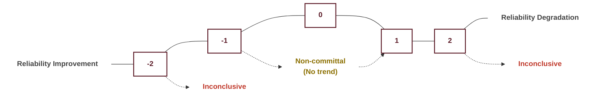

```mermaid
flowchart LR
    %% Axis with tick labels
    L[Reliability Improvement] --- M2["-2"] --- M1["-1"] --- Z["0"] --- P1["1"] --- P2["2"] --- R[Reliability Degradation]

    %% Region captions (no HTML; dashed links just position them)
    NT["Non-committal\n(No trend)"]
    IL["Inconclusive"]
    IR["Inconclusive"]

    M1 -.-> NT
    NT -.-> P1
    M2 -.-> IL
    P2 -.-> IR

    %% Styling
    classDef axis fill:#fff,stroke:#5b1a26,stroke-width:2px,color:#5b1a26;
    classDef label fill:transparent,stroke:transparent,color:#8b6f00,font-weight:bold;
    classDef warn fill:transparent,stroke:transparent,color:#c0392b,font-weight:bold;
    classDef meta fill:transparent,stroke:transparent,color:#444;

    class M2,M1,Z,P1,P2 axis
    class L,R meta
    class NT label
    class IL,IR warn

```

