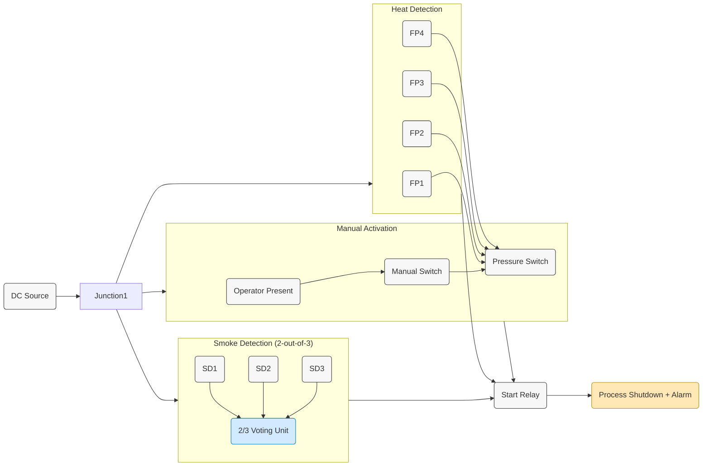

```mermaid
flowchart LR
%% -----------------------------
%% FIRE DETECTOR SYSTEM RBD (Matched to given schematic)
%% -----------------------------

DC(DC Source):::comp --> Junction1

%% PARALLEL PATHS
subgraph Manual_Activation["Manual Activation"]
    OP(Operator Present):::comp --> MS(Manual Switch):::comp --> PS(Pressure Switch):::comp
end

subgraph Smoke_Detection["Smoke Detection (2-out-of-3)"]
    SD1(SD1):::comp & SD2(SD2):::comp & SD3(SD3):::comp --> VU(2/3 Voting Unit):::logic
end

subgraph Heat_Detection["Heat Detection"]
    FP1(FP1):::comp & FP2(FP2):::comp & FP3(FP3):::comp & FP4(FP4):::comp --> PS
end

Junction1 --> Manual_Activation
Junction1 --> Smoke_Detection
Junction1 --> Heat_Detection

%% OUTPUT PATH
Manual_Activation --> SR(Start Relay):::comp
Smoke_Detection --> SR
Heat_Detection --> SR
SR --> OUT(Process Shutdown + Alarm):::output

%% STYLES
classDef comp fill:#f7f7f7,stroke:#333,stroke-width:1px;
classDef logic fill:#d1eaff,stroke:#0077b6,stroke-width:1px;
classDef output fill:#ffe8b6,stroke:#b68900,stroke-width:1px;

```