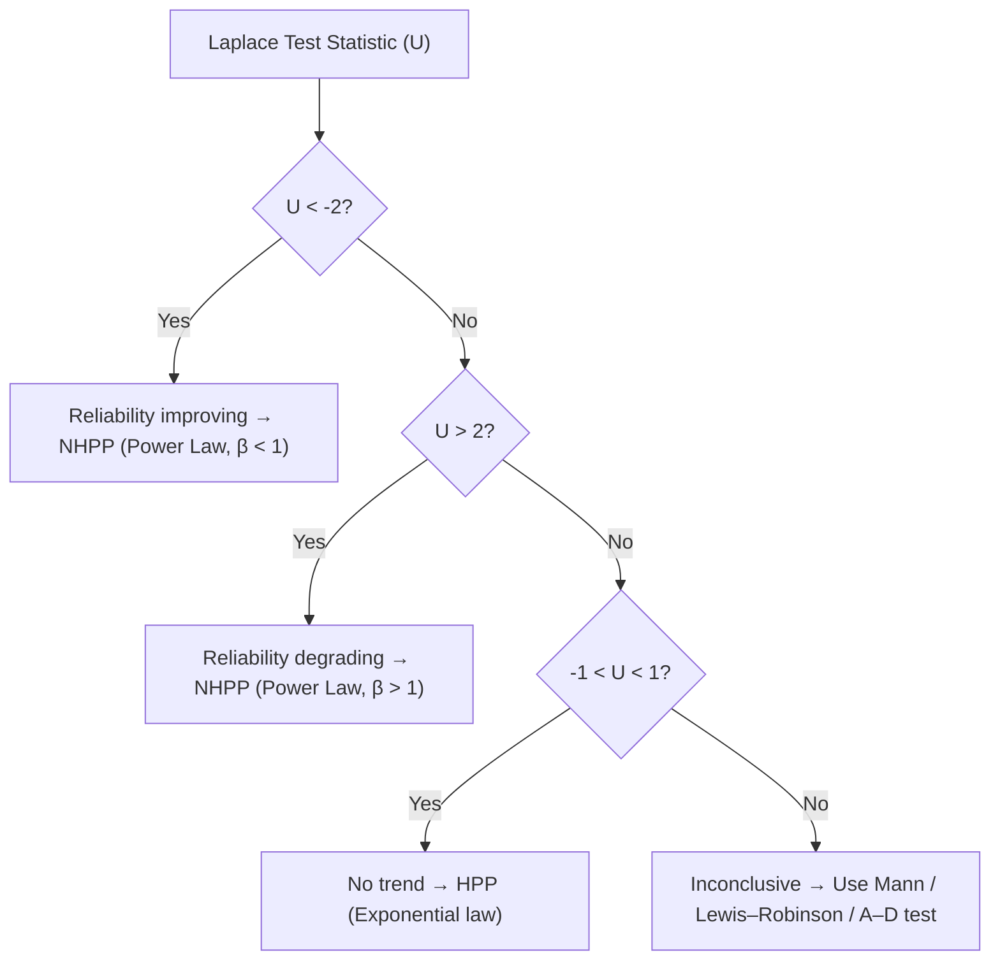

The Laplace trend test evaluates whether failure data show **no trend**, **improvement**, or **degradation** over time.  
It helps decide whether the system follows a **Homogeneous Poisson Process (HPP)** or a **Non-Homogeneous Poisson Process (NHPP)**.

---

## Quick Rules (as per Lecture Notes §3.6.2)

| Range of U  | Interpretation                    | System Behaviour               | Suitable Model                                    | Remarks                      |
| ----------- | --------------------------------- | ------------------------------ | ------------------------------------------------- | ---------------------------- |
| U < -2      | Reliability improving             | Failures occur less frequently | **NHPP (Power Law, β < 1)**                       | Repairable system            |
| -2 ≤ U ≤ -1 | Inconclusive                      | Possible improvement           | Use Mann / Lewis–Robinson / Anderson–Darling test | Repairable system            |
| -1 < U < 1  | **No trend (stationary process)** | Constant failure rate          | **HPP (Exponential law)**                         | Repairable or Non-repairable |
| 1 ≤ U ≤ 2   | Inconclusive                      | Possible degradation           | Use additional trend tests                        | Repairable system            |
| U > 2       | Reliability degrading             | Failures occur more frequently | **NHPP (Power Law, β > 1)**                       | Repairable system            |

---

### Notes (aligned with QM444)
- Critical region at 5% significance: ±1.96 ≈ ±2  
- If \( |U| < 2 \): no significant evidence of a trend → **HPP (constant rate)**  
- If \( U > 2 \): trend increasing → **NHPP (deteriorating system)**  
- If \( U < -2 \): trend decreasing → **NHPP (improving system)**  
- When trend is absent, data can also be modelled as **non-repairable (life data analysis)** using **Weibull / Exponential**.

---

## Mermaid Decision Summary

^laplace-flow