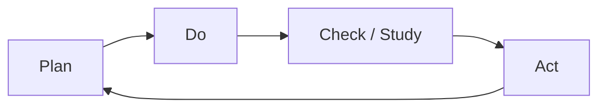

**Chapter 5 – Quality Improvement & Breakthrough Performance**

*Source: Lecture 11-split (p. 2)*  
*Focus: PDCA / PDSA cycle • Breakthrough thinking • Continuous improvement*

---

## 🧭 1 | The Big Picture

> **Purpose:** Understand what you’re trying to improve and why.

**Frameworks**
- **5W2H** – Define the problem before solving:  
  *What, Why, Where, When, Who + How, How much*  
- **Levels of thinking:** Strategic (why & what) → Tactical (how) → Operational (actions).  
- **Effectiveness vs Efficiency:**  
  - <i>Effectiveness</i> = doing the right things  
  - *Efficiency* = doing things right  
  - Quality improvement needs both.

> [!note]  
> Poor effectiveness + high efficiency = “doing the wrong things very well.”  

---

## ⚙️ 2 | Types of Quality Problems

> [!example] Sporadic vs Chronic Problems — Revision
>
> Revision from [[Quality Fundamentals & Juran Trilogy (Ch1)#⚠️ Types of Quality Problems]]
>
> | Type                         | Nature                           | Remedy                                 |
> | ---------------------------- | -------------------------------- | -------------------------------------- |
> | **Sporadic**                 | Sudden change from status quo    | Restore status quo via control process |
> | **Chronic**                  | Long-term, accepted issues       | Continuous improvement → Kaizen        |
> | **Growth / Future-oriented** | Anticipate next stage of quality | Preventive innovation                  |
> | **Innovation ("iPad-type")** | Radical shift / disruption       | Breakthrough thinking                  |
>
> Continuous improvement (Kaizen) tackles chronic issues across the whole organisation.

---

## 🔄 3 | PDCA / PDSA Cycle (core improvement loop)

**P** Plan – Identify problem, collect data, set objectives.  
**D** Do – Implement on small scale (test).  
**C / S** Check / Study – Measure and analyse results.  
**A** Act – Standardise successful changes or adjust and re-run.

> [!important]  
> The cycle supports *incremental improvement (Kaizen)* and is a base for larger breakthroughs.

---

## 🚀 4 | Breakthrough Performance

**Definition:**  
Large, discontinuous jumps in performance that go beyond incremental improvement.

### Two Journeys
1. **Diagnostic Journey**
   - Problem → Symptoms  
   - Symptoms → Theories of causes  
   - Theories → Tests → Root cause(s)
2. **Remedial Journey**
   - Root cause → Design remedies  
   - Test remedies → Operate under real conditions  
   - Overcome resistance → Establish controls to hold gains

### Juran’s Universal Sequence for Breakthrough
1. Nominate and identify problems.  
2. Establish project and team.  
3. Diagnose cause(s).  
4. Remedy cause(s).  
5. Hold the gains.  
6. Replicate results and nominate new projects.  

> [!note]  
> Breakthroughs need leadership mandate + project charters + resources + review + recognition.

---

## 💼 5 | Structured Approach to Quality Improvement

| Step | Focus | Key Tasks |
|------|--------|-----------|
| **1. Set Up** | *Business case + infrastructure* | Prove need, estimate waste & benefits, launch teams |
| **2. Carry Out** | *Project execution* | Define scope & charter, diagnose causes, prove remedy |
| **3. Control** | *Sustain the gains* | Manage resistance, institutionalise controls |

> [!example]  
> Goal: halve quality-related costs within five years is a typical target for a first programme.

---

## 🌐 6 | Complex Adaptive Systems (CAS)

Quality improvement happens in dynamic systems of people and processes.  
Interventions in one area affect others. Change must consider inter-dependencies.

> [!tip]  
> Breakthrough projects should be “doable” within existing complex systems and well scoped.

---

## ✅ 7 | Key Takeaways

- Use 5W2H to frame the problem.  
- Distinguish sporadic vs chronic issues.  
- Apply PDCA cycle for continuous improvement.  
- For major change, follow Juran’s breakthrough sequence.  
- Link strategy (effectiveness) and operations (efficiency).  
- Build a business case and infrastructure to sustain results.

---

> [!quote]  
> *“Improvement happens project by project, and in no other way.”* – J. M. Juran  

https://chatgpt.com/share/69025948-3aec-8013-b2c1-8b6b1e46d0ab