> [!summary] Overview
> This map shows how all Quality Management concepts integrate together, centered around **Juran's Trilogy** as the core framework.

---

## 🎯 The Complete Quality Management System


---

## 🔄 The Three Core Cycles

### 1. Juran's Trilogy (Overarching Framework)


### 2. PDCA/PDSA (Improvement Cycle)


### 3. Feedback Loop (Control Cycle)


---

## 📊 Methodology Comparison: When to Use What


---

## 🎓 Integration Logic: How Concepts Connect

### Level 1: Strategic Foundation
**Start Here:**
- **Juran's Trilogy (PCI)** = The master framework
- **Strategic Planning & Deployment** = Aligns quality with business goals
- **Quality Assessment (COPQ)** = Measures cost and impact

### Level 2: The Three Phases

#### Phase 1: PLANNING (Design Quality In)
**Purpose:** Prevent problems before they exist

**Primary Frameworks:**
- **Quality by Design (QbD)** - Juran's 6-step planning model
- **DFSS/DMADV** - Design for Six Sigma for new systems

**Key Concepts:**
- **VOC → CTQs** - Convert customer voice to measurable requirements
- **GFD/QFD** - Deploy requirements through design
- **FMEA** - Predict and prevent failures
- **DOE** - Optimize design parameters

**Output:** A capable process that meets customer needs

---

#### Phase 2: CONTROL (Maintain Standards)
**Purpose:** Keep performance stable and on-target

**Primary Framework:**
- **Feedback Loop** (Sensor → Umpire → Actuator → Process)

**Key Concepts:**
- **KPC/KCC** - Define what to control (product & process characteristics)
- **QC vs QA** - In-process control vs. verification
- **SOPs** - Standard operating procedures
- **Inspection & Testing** - Verify conformance
- **Measurement Systems** - Ensure data reliability

**Tools:**
- Control charts
- Self-control systems
- Real-time monitoring

**Output:** Stable, predictable performance

---

#### Phase 3: IMPROVEMENT (Raise Performance)
**Purpose:** Eliminate chronic problems and breakthrough to new levels

**Primary Frameworks:**
- **PDCA/PDSA** - Continuous incremental improvement (Kaizen)
- **Six Sigma DMAIC** - Systematic breakthrough improvement
- **RCCA** - Root cause corrective action

**When to Use What:**
- **JDI (Just Do It)** → Obvious cause, low risk, quick fix
- **PDCA** → Iterative testing, small improvements, known fixes
- **RCCA** → Unknown cause needs investigation (5 Whys, Fishbone, Pareto)
- **DMAIC** → Complex problem needs data-driven systematic approach

**Key Concepts:**
- **Sporadic vs Chronic Problems** - Different remedies needed
- **5 Whys** - Dig to root cause
- **Fishbone/Ishikawa** - Map possible causes
- **Pareto Analysis** - Focus on vital few
- **FMEA** - Prevent recurrence
- **DOE** - Optimize solutions
- **MOMS** - Define measurable problems

**Output:** Higher capability, eliminated chronic waste

---

### Level 3: Cross-Cutting Enablers
**These support all three phases:**

#### Voice of Customer (VOC)
- Drives planning (what to design)
- Defines control subjects (what to measure)
- Prioritizes improvements (what matters)

#### Variation Management
- **Six Sigma philosophy** - Reduce variation to 3.4 defects per million
- Statistical methods distinguish common vs. special cause
- Process capability analysis

#### Organizational Structure
- **Six Sigma Roles** - Champions, Black Belts, Green Belts, Process Owners
- **Deployment** - Top-down strategy, bottom-up execution
- **Culture** - Breakthrough thinking, employee engagement

---

## 🧠 Mental Model: The Quality House

```mermaid
graph TD
    subgraph "🏛️ The Quality Management House"
        Roof[Juran's Trilogy: Plan → Control → Improve]

        subgraph Left["📐 PLANNING PILLAR"]
            L1[QbD - Quality by Design]
            L2[DFSS/DMADV]
            L3[VOC → CTQs]
            L4[FMEA Prevention]
            L5[DOE Design]
        end

        subgraph Center["⚙️ CONTROL PILLAR"]
            C1[Feedback Loop]
            C2[KPC/KCC]
            C3[QC & QA]
            C4[SOPs]
            C5[Inspection & Testing]
        end

        subgraph Right["📈 IMPROVEMENT PILLAR"]
            R1[PDCA/Kaizen]
            R2[Six Sigma DMAIC]
            R3[RCCA - Root Cause]
            R4[5 Whys, Fishbone]
            R5[Pareto, FMEA]
        end

        subgraph Foundation["🏗️ FOUNDATION"]
            F1[Strategic Planning & Deployment]
            F2[Six Sigma Roles & Structure]
            F3[Quality Assessment & COPQ]
            F4[VOC & CTQs]
            F5[Variation Management]
        end

        Roof --> Left
        Roof --> Center
        Roof --> Right
        Left --> Foundation
        Center --> Foundation
        Right --> Foundation
    end

    style Roof fill:#ff6b6b,stroke:#c92a2a,stroke-width:3px,color:#fff
    style Left fill:#e3f2fd,stroke:#1976d2,stroke-width:2px
    style Center fill:#fff3e0,stroke:#f57c00,stroke-width:2px
    style Right fill:#fce4ec,stroke:#c2185b,stroke-width:2px
    style Foundation fill:#f1f3f4,stroke:#5f6368,stroke-width:2px
```



**The Quality House explains:**
- **Roof (Trilogy)** - The overarching framework covering everything
- **Three Pillars** - The three phases working together
- **Foundation** - Strategic elements and enablers supporting all phases

**Key Insight:** All pillars rest on the same foundation. Weakness in one pillar affects the whole structure.

---

## 🔑 Key Relationships to Remember

### 1. VOC Drives Everything
```
VOC → CTQs → Design (QbD/DFSS) → KPC/KCC (Control) → Improvement Targets (DMAIC)
```

### 2. Problem Type → Method
```
Sporadic Problem → Control (restore status quo)
Chronic Problem → Improvement (change status quo)
Future/Innovation → Planning (design new system)
```

### 3. Methodology Escalation
```
JDI (obvious fix)
    ↓ If more complex
PDCA (iterative testing)
    ↓ If cause unknown
RCCA (investigate root cause)
    ↓ If systematic breakthrough needed
DMAIC (data-driven improvement)
    ↓ If need new design
DMADV (create new system)
```

### 4. DMAIC vs DMADV
```
DMAIC: Define → Measure → Analyze → Improve → Control (fix existing)
DMADV: Define → Measure → Analyze → Design → Verify (create new)
```

### 5. Quality Cost Flow
```
Prevention Cost → Reduces → Appraisal Cost
Prevention + Appraisal → Reduces → Internal Failure
All three → Reduces → External Failure (most expensive)

Total COPQ = Prevention + Appraisal + Internal Failure + External Failure
```

### 6. Control Hierarchy
```
Strategic Level: Business goals, deployment, COPQ
Tactical Level: Process KPCs/KCCs, feedback loops
Operational Level: SOPs, inspection, self-control, real-time adjustment
```

---

## 📝 Study Strategy: Connecting the Dots

### For Exam Preparation:

1. **Master the Core (Juran's Trilogy)**
   - Everything connects back to Plan → Control → Improve
   - Know which concepts belong to which phase

2. **Understand the Relationships**
   - How does VOC flow through the system?
   - When do you use DMAIC vs DMADV?
   - What's the difference between QC and QA?

3. **Know the Tools by Purpose**
   - Don't just memorize tools
   - Understand WHEN and WHY to use each
   - Example: "FMEA for prevention in planning; also for preventing recurrence in improvement"

4. **Practice Integration Questions**
   - "Design a quality management implementation plan" (uses all phases)
   - "How would you approach this problem?" (choose right methodology)
   - "Trace VOC to controlled KPCs" (connects planning to control)

5. **Use This Map as a Navigator**
   - When studying any concept, locate it on this map
   - Ask: "What phase? What connects to it? When do I use it?"

---

## 🎯 Quick Reference: Concept Location Guide

| Concept | Primary Phase | Also Used In | Purpose |
|---------|--------------|--------------|---------|
| **DOE** | Planning (design) | Improvement (optimize) | Design parameters or optimize solutions |
| **FMEA** | Planning (prevent) | Improvement (prevent recurrence) | Predict failures, assess risk |
| **CTQs** | Planning (define) | Control (measure), Improve (target) | Critical to Quality characteristics |
| **VOC** | Planning (discover) | All phases | Customer voice drives everything |
| **5 Whys** | Improvement (analyze) | Control (diagnose) | Dig to root cause |
| **Fishbone** | Improvement (brainstorm) | Planning (risk ID) | Map possible causes |
| **Pareto** | Improvement (prioritize) | Assessment (focus) | Identify vital few |
| **KPC/KCC** | Control (define) | Planning (specify) | Key characteristics to control |
| **PDCA** | Improvement (iterate) | Control (correct) | Continuous improvement cycle |
| **Six Sigma** | Strategy (framework) | All phases | Variation reduction philosophy |
| **DMAIC** | Improvement (systematic) | - | Fix existing processes |
| **DMADV** | Planning (design) | - | Create new systems |
| **QbD** | Planning (design) | - | Quality by Design model |
| **Feedback Loop** | Control (operate) | - | Sensor→Umpire→Actuator→Process |
| **COPQ** | Assessment (measure) | Strategy (prioritize) | Cost of Poor Quality |
| **SOPs** | Control (standardize) | Improvement (sustain gains) | Standard Operating Procedures |

---

## 💡 Final Integration Insight

> **"Design quality in (Planning), Keep it there (Control), Make it better (Improvement)"**

The entire Quality Management system is a **continuous cycle**:
1. **Plan** what customers need and design capable processes
2. **Control** those processes to maintain performance
3. **Improve** to eliminate chronic problems and raise capability
4. **Re-plan** with new higher standards
5. Repeat forever

**Everything else** - all the tools, frameworks, methodologies - **supports this cycle**.

Your exam success depends on understanding:
- **Where** each concept fits in this cycle
- **When** to use which tool or methodology
- **How** concepts connect and support each other
- **Why** the system works as an integrated whole

Use this map to navigate your studies and ensure you see the **big picture** while mastering the details.

---

**Good luck with your exam! 🎓**
